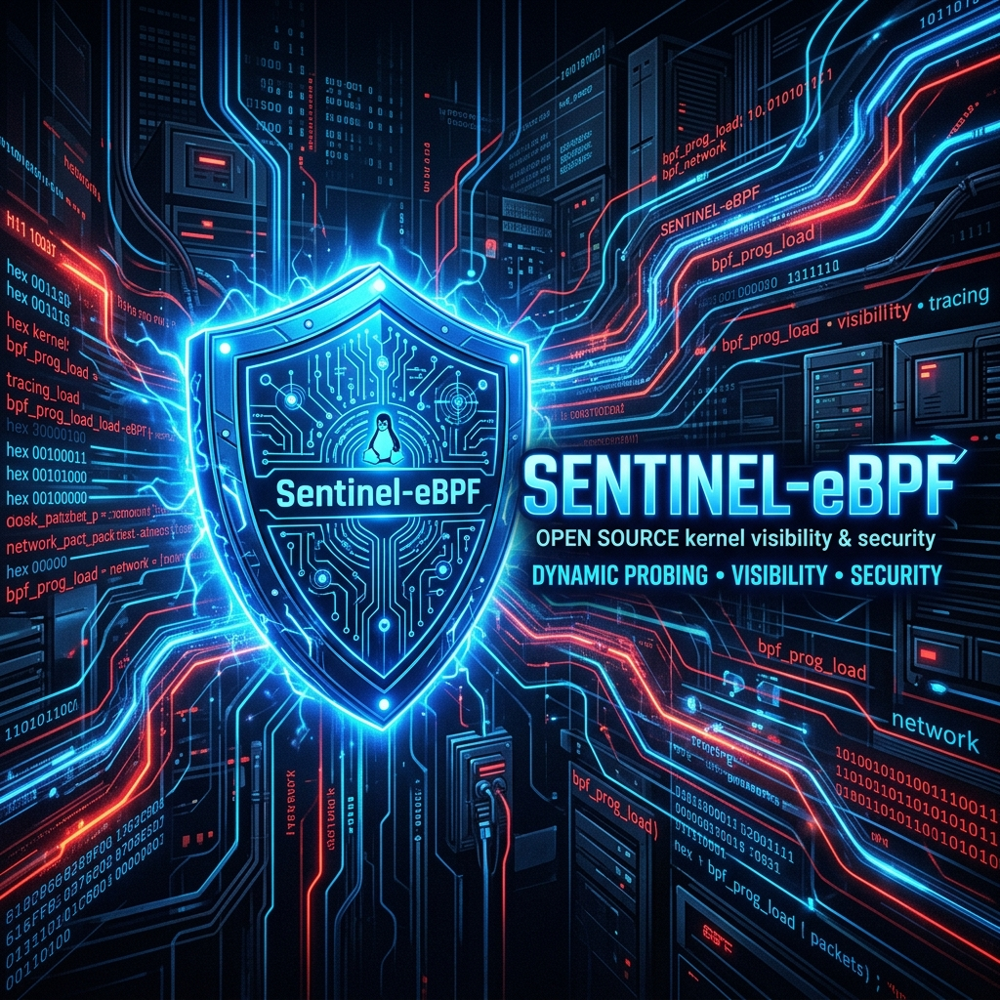

<div align="center">



# Sentinel-eBPF: Agentic Security Copilot 🛡️

[](https://go.dev/)
[](https://opensource.org/licenses/MIT)
[](https://ebpf.io/)
[](https://reactjs.org/)

**The ultimate Kubernetes-aware, AI-driven Linux runtime security engine.**

[Features](#features) • [Architecture](#architecture) • [Getting Started](#getting-started) • [Contributing](#contributing)

</div>

---

## 🌟 What is Sentinel-eBPF?
Sentinel-eBPF is an advanced Linux security observability and containment tool. It drops hooks directly into the Linux Kernel using **eBPF (Extended Berkeley Packet Filter)** to intercept system calls like `execve` and `connect` with zero overhead. 

But it doesn't stop there. Instead of just logging, Sentinel-eBPF evaluates execution trees using a dynamic YAML engine, maps them to their respective **Docker/Kubernetes Cgroups**, and streams them to an **Agentic AI Copilot** to make intelligent, real-time `SIGKILL` decisions.

## ✨ Features
- **Deep Kernel Telemetry:** Hooks `sys_enter_execve` and `sys_enter_connect` directly in kernel-space.
- **Container Awareness:** Automatically extracts the Linux `cgroup_id` for every process, making it perfect for Docker and Kubernetes clusters.
- **Dynamic YAML Rules:** A hot-reloadable policy engine. Block or allow execution based on complex Parent-Child process trees without writing C code.
- **Agentic AI Copilot Hook:** An architectural integration that packages suspicious contexts into JSON payloads and asks an LLM (e.g., OpenAI/Gemini) if a process is malicious *before* taking action.
- **Enterprise Web Dashboard:** A beautiful, glassmorphic React interface that streams live telemetry and metrics directly from the kernel daemon.

## 🏗️ Architecture
1. **`ebpf/sentinel.c`**: The eBPF C program compiled into kernel byte-code. It intercepts system calls and writes rich telemetry payloads into a BPF Ring Buffer.
2. **`main.go`**: The Go User-Space Daemon. It reads from the BPF Ring Buffer, evaluates the `config.yaml` policies, queries the AI Copilot, and issues containment actions (`SIGKILL`). It also hosts the REST API.
3. **`dashboard/`**: The Vite + React web application. It connects to the Go daemon's REST API and visualizes the system's security posture in real-time.

---

## 🚀 Getting Started

### Prerequisites
- Linux Kernel version >= 5.8 (WSL2 Ubuntu supported!)
- `clang` and `llvm` installed.
- Go 1.20+
- Node.js 18+ (for the Dashboard)

### Installation

1. **Clone the repository:**
```bash
git clone https://github.com/lochanachamod/sentinel-ebpf.git
cd sentinel-ebpf
```

2. **Configure your policies:**
Edit the `config.yaml` file to define your blocked executables and AI Copilot endpoints.

3. **Start the Go Kernel Daemon:**
```bash
# Compiles the eBPF C code and starts the daemon
sudo make run
```

4. **Start the Web Dashboard:**
Open a new terminal window:
```bash
cd dashboard
npm install
npm run dev
```
Visit `http://localhost:5173` in your browser to view the Command Center!

---

## 🛡️ Example Alert
When a suspicious process is executed (e.g., spawning `/bin/sh` from a web server), Sentinel-eBPF instantly logs and reacts:

```text
[EXECVE] Cgroup: 4192, Parent: node, UID: 1000, Executing: /bin/sh (PID: 1042)
⚠️  ANOMALY DETECTED [Rule: AI Copilot Shell Evaluation]: Execution of /bin/sh by parent node in Cgroup 4192.
🤖 Sending telemetry to AI Copilot at https://api.sentinel-ai.local/v1/evaluate...
🤖 AI Decision: KILL (Confidence: 0.98) - Reason: Interactive shells spawned by arbitrary parents are highly suspicious.
🛡️  CONTAINMENT TRIGGERED: Sending SIGKILL to PID 1042...
✅ Process 1042 successfully terminated.
```

---

## 🤝 Contributing
We love community contributions! Please read our [CONTRIBUTING.md](CONTRIBUTING.md) for details on our code of conduct, and the process for submitting pull requests to us.

## 📄 License
This project is licensed under the MIT License - see the [LICENSE](LICENSE) file for details.
